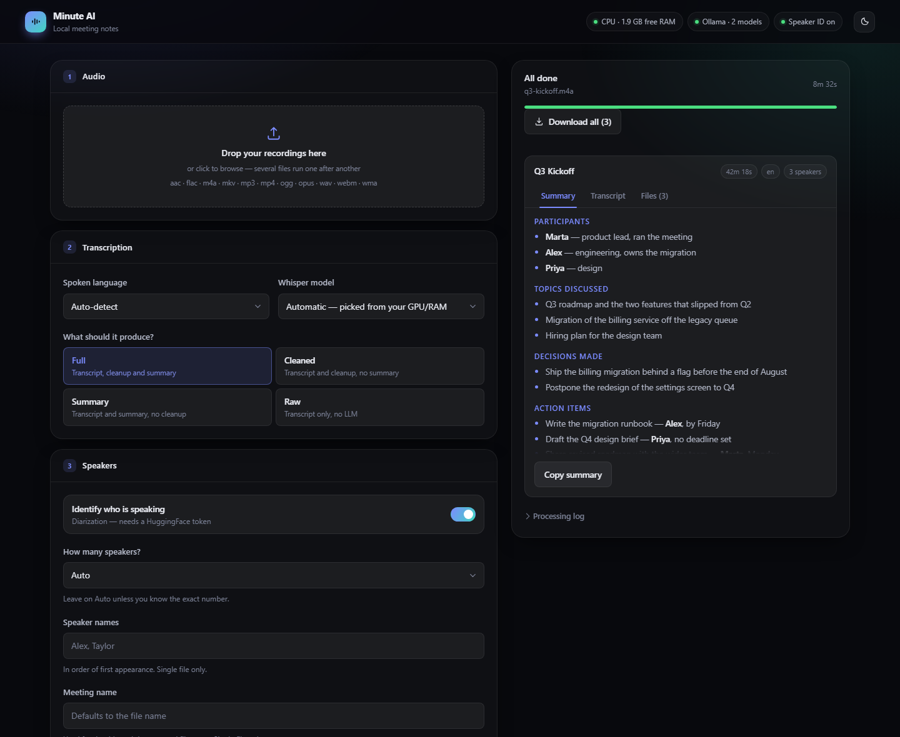
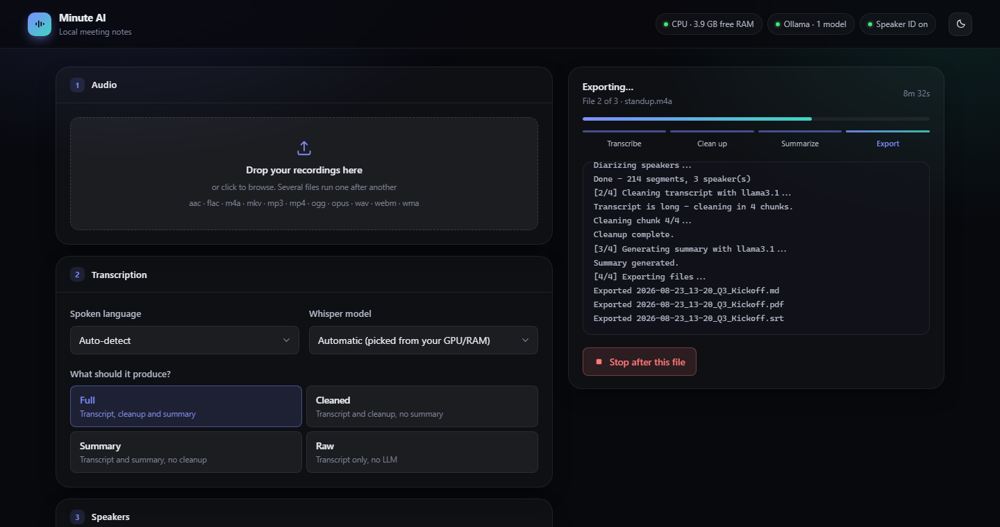
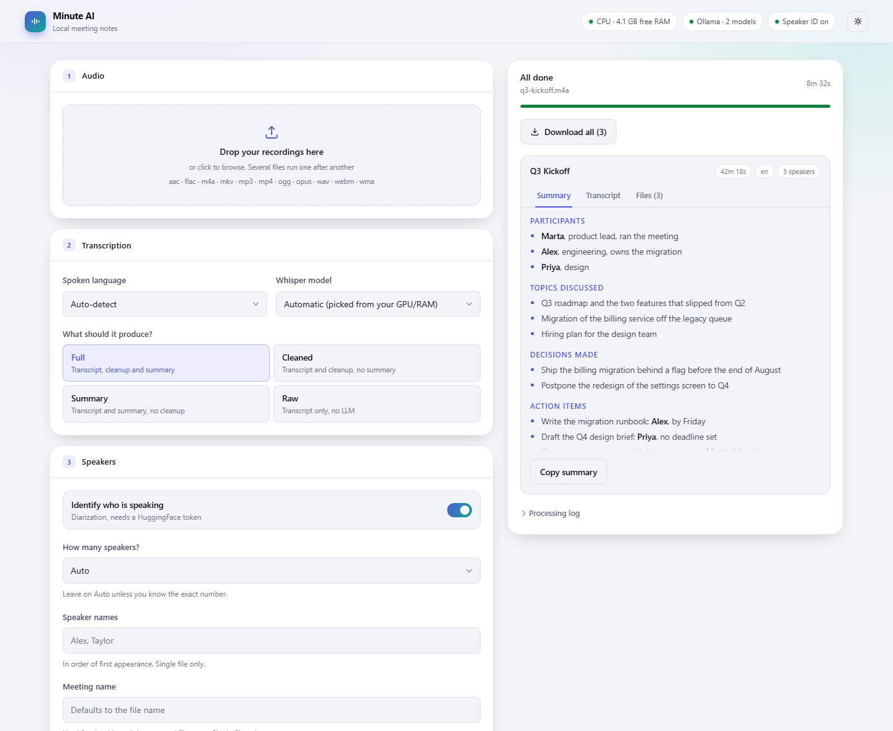

<div align="center">

# minute-ai

**Turn meeting recordings into structured notes — entirely on your own machine.**

[](https://github.com/RenatoGallicola/minute-ai/actions/workflows/ci.yml)
[](LICENSE)
[](pyproject.toml)
[](tests/)

</div>

minute-ai transcribes a recording, works out who said what, cleans up the speech-to-text output and
writes a structured summary — decisions, action items, open questions. It runs Whisper and a local
LLM on your own hardware, so no audio and no transcript ever leaves the machine. Use it from the
command line or from a local web app.

<div align="center">
  
</div>

---

## Why this exists

Meeting-notes tools are almost all cloud services: you upload the recording, and someone else's
servers hold the audio and the transcript. That is a non-starter for anything confidential — a
performance review, a legal call, an unannounced product decision, patient or client information.

minute-ai does the same job locally. The trade-off is honest: it is slower than a GPU datacentre,
and a 3B local model does not write as well as a frontier one. In exchange, the recording never
leaves your disk, there is no account, no subscription and no upload limit.

## Features

- **Transcription with speaker labels** — [whisperX](https://github.com/m-bain/whisperX) for the
  transcript and word-level timestamps, [pyannote](https://github.com/pyannote/pyannote-audio) to
  tell voices apart. Name them yourself with `--speaker-names "Marco,Sara"`.
- **Cleanup pass** — a local LLM repairs mishearings and punctuation without rewriting what was said.
- **Summaries shaped for the recording** — presets for meetings, lectures, interviews and
  one-on-ones, or your own instructions. A lecture summary should not have an "Action Items" section.
- **Five export formats** — Markdown, plain text, Word, PDF, and SRT subtitles.
- **100 languages**, auto-detected, with the summary in the same language or any other.
- **Batch processing**, sequentially or several files at once.
- **A local web app** as well as a CLI — same pipeline, same options, no cloud in either.

## Quickstart

Python 3.10–3.12 (whisperX does not support 3.13+), [Ollama](https://ollama.com), and
[ffmpeg](https://ffmpeg.org) on your `PATH`.

```bash
git clone https://github.com/RenatoGallicola/minute-ai.git
cd minute-ai

py -3.12 -m venv venv
venv\Scripts\activate          # Windows
# source venv/bin/activate     # macOS / Linux

pip install torch torchvision torchaudio   # CPU build; see pytorch.org for CUDA
pip install -r requirements.txt

copy config.example.py config.py           # cp on macOS / Linux
ollama pull llama3.2:3b
```

Open `config.py` and paste a [HuggingFace token](https://huggingface.co/settings/tokens) into
`HF_TOKEN` — it is needed to download the diarization model, and you must accept the terms of
`pyannote/speaker-diarization-community-1`. Skip it entirely if you always run with `--no-diarize`.

Then:

```bash
python main.py inputs/meeting.m4a      # command line
python gui.py                          # web app on http://127.0.0.1:7860
```

First run downloads the Whisper and diarization models (~2 GB) into your HuggingFace cache.

> **Behind a corporate proxy?** If HuggingFace or the Ollama registry are blocked, download the
> models on an unrestricted machine and copy `~/.cache/huggingface/hub/` and `~/.ollama/models/`
> across. `--model auto` deliberately prefers a model you already have rather than starting a
> multi-gigabyte download that would fail.

## Example output

[`examples/artemis-iii-training.md`](examples/artemis-iii-training.md) is a complete, unedited run on
four minutes of a public-domain NASA podcast — two speakers, summarised with the `interview` preset.
The [notes alongside it](examples/README.md) give the exact command and are frank about where a small
local model still shows its limits.

## How it works

```
audio ──► whisperX ──► pyannote ──► Ollama ──► Ollama ──► export
          transcribe   diarize      clean up   summarize   md/txt/docx/pdf/srt
             [1/4]      [1/4]        [2/4]       [3/4]        [4/4]
```

Four decisions worth calling out, because each one came from something that went wrong:

**Long recordings are chunked, not truncated.** Ollama silently cuts any prompt longer than its
context window — no error, no warning. A one-hour meeting would have been summarised from whatever
fragment happened to fit. minute-ai requests the context window explicitly and splits long
transcripts on speaker boundaries, summarising chunk by chunk and then merging. The preset drives
every pass, not just the last one, so a lecture's key concepts are not discarded during the map stage.

**Failures degrade instead of cascading.** The transcript is the expensive part; nothing downstream
is allowed to throw it away.

| Problem | What happens |
|---|---|
| Ollama down, or the model not pulled | Cleanup and summary are skipped with a warning; the transcript is still exported |
| Diarization fails (bad or ungated token) | Transcript kept and exported, without speaker labels |
| No alignment model for the detected language | Timestamps stay unaligned; everything else continues |
| One file fails in a batch | The rest still run; the closing summary says what failed and why |

**`--model auto` prefers a model you already have.** Choosing purely on available RAM would pick
`large-v3` on a big machine and quietly start a 3 GB download — exactly what fails on a locked-down
network. Among the models that fit the hardware, one already on disk wins.

**The CLI and the GUI cannot drift apart.** They share the pipeline, and
[`tests/test_cli_gui_parity.py`](tests/test_cli_gui_parity.py) compares their options, accepted
values and validation rules automatically. Adding a flag to one side fails the suite until the other
side has it — or until the allowlist explains why it should not.

## The web app

```bash
python gui.py     # http://127.0.0.1:7860
```

FastAPI + Jinja2 + [htmx](https://htmx.org), styled with a hand-written CSS design system.
**No Node, no build step** — edit `static/app.css` or a template and reload. (This replaced a
precompiled Tailwind build whose stylesheet silently lacked any class added after the last run.)

<div align="center">
  
</div>

The interface reacts to what your machine can actually do. `/api/health` is fetched after first
paint, so the page never blocks on an unreachable Ollama, and reports whether Ollama is *reachable*
separately from *usable* — a fresh install is the first without being the second. When the LLM is
unavailable the modes that need it are disabled outright rather than failing later, Whisper models
are marked *ready* or with their download size, and the model picker offers only what Ollama has
installed.

Progress streams to the page once a second, parsed from the same `[n/4]` stage markers the CLI
prints. Light and dark themes follow your OS, and every colour comes from one block of tokens at the
top of the stylesheet.

<div align="center">
  
</div>

## Usage

```bash
# Single file, full pipeline, Markdown out
python main.py inputs/meeting.m4a

# A lecture: no decisions or action items, just concepts and definitions
python main.py inputs/lecture.mp3 --summary-preset lecture --speakers 1

# Summary only, as a PDF, written in Italian
python main.py inputs/meeting.m4a --format pdf --export-content summary --summary-language it

# A whole folder, four files at a time
python main.py inputs/ --parallel --parallel-workers 4

# Your own summary structure
python main.py inputs/call.m4a --summary-preset custom \
    --summary-prompt "## Risks
Anything that could delay delivery.

## Owners
Who committed to what."
```

### Pipeline modes

| `--mode` | Transcribe | Cleanup | Summary |
|---|:---:|:---:|:---:|
| `full` *(default)* | ✓ | ✓ | ✓ |
| `clean` | ✓ | ✓ | — |
| `summary` | ✓ | — | ✓ |
| `transcript` | ✓ | — | — |

### Summary presets

| `--summary-preset` | Sections |
|---|---|
| `meeting` *(default)* | Participants · Topics · Decisions · Action Items · Open Points · Notes |
| `lecture` | Overview · Key Concepts · Definitions · Examples · Practical Notes · Open Questions |
| `interview` | Participants · Topics · Key Points · Notable Quotes · Follow-ups |
| `one-on-one` | Updates · Blockers · Feedback · Agreed Next Steps |
| `custom` | Whatever you write in `--summary-prompt` |

A custom prompt normally describes the sections you want, and minute-ai wraps it with the transcript
and language. Write `{transcript}` anywhere in it to take over the whole prompt instead.

<details>
<summary><b>All command-line options</b></summary>

| Option | Default | Description |
|---|---|---|
| `--recursive` / `-r` | — | When a folder is given, also look inside sub-folders |
| `--language` / `-l` | `auto` | `auto` or any of the 100 codes Whisper supports |
| `--speakers` / `-s` | `auto` | Number of speakers, or `auto`. `1` skips diarization entirely |
| `--speaker-names` | — | `"Marco,Sara"`, in order of first appearance (single file, needs diarization) |
| `--meeting-name` / `-n` | filename | Title and output file name (single file only) |
| `--model` / `-m` | `auto` | `auto` `tiny` `base` `small` `medium` `large-v3` |
| `--no-diarize` | — | Skip speaker identification |
| `--mode` | `full` | `full` `transcript` `clean` `summary` |
| `--cleanup-model` | `llama3.1` | Ollama model for the cleanup pass |
| `--summary-model` | `llama3.1` | Ollama model for the summary |
| `--summary-preset` | `meeting` | `meeting` `lecture` `interview` `one-on-one` `custom` |
| `--summary-prompt` | — | Instructions replacing the preset |
| `--summary-prompt-file` | — | Read those instructions from a file |
| `--summary-language` | `same` | `same`, or any supported language code |
| `--output-dir` / `-o` | `outputs/` | Where to write |
| `--format` / `-f` | `md` | `md` `txt` `docx` `pdf` `srt` `all` |
| `--export-content` | `full` | `full` (summary + transcript) or `summary` |
| `--parallel` | — | Process several files concurrently |
| `--parallel-workers` | `2` | How many at a time |
| `--force` | — | Reprocess files that already have output |

`--no-diarize` is incompatible with `--speakers` and `--speaker-names`. `--export-content summary`
needs a mode that produces one. `--format srt` carries the timestamped transcript only.

</details>

<details>
<summary><b>Automatic model selection</b></summary>

`--model auto` picks from a CUDA GPU when there is one, otherwise from free system RAM:

| Free RAM (CPU) | GPU VRAM | Model |
|---|---|---|
| ≥ 16 GB | ≥ 7 GB | `large-v3` |
| ≥ 8 GB | ≥ 4 GB | `medium` |
| ≥ 4 GB | ≥ 2 GB | `small` |
| ≥ 2 GB | ≥ 1 GB | `base` |
| < 2 GB | < 1 GB | `tiny` |

With `--parallel` the budget is divided by the worker count, since each worker loads its own model.
Among the models that fit, one already downloaded always wins. `DEFAULT_COMPUTE_TYPE = "auto"` picks
`float16` on a GPU and `int8` on CPU.

</details>

<details>
<summary><b>Configuration (config.py)</b></summary>

`config.py` is git-ignored and holds every default; copy it from `config.example.py`. Notable keys:

| Key | Default | Why it matters |
|---|---|---|
| `HF_TOKEN` | — | Required for diarization only |
| `OLLAMA_NUM_CTX` | `8192` | Ollama's own default is small and truncates long prompts silently |
| `LLM_CHUNK_CHARS` | `6000` | Transcript characters per LLM request |
| `OLLAMA_TIMEOUT` | `600` | Seconds to wait for one generation |
| `DEFAULT_COMPUTE_TYPE` | `auto` | `float16` on GPU, `int8` on CPU |

Raise `OLLAMA_NUM_CTX` and `LLM_CHUNK_CHARS` together if you have memory to spare — fewer, larger
passes usually give a better summary.

</details>

<details>
<summary><b>CLI and GUI parity</b></summary>

Both front ends expose the same options, enforced by
[`tests/test_cli_gui_parity.py`](tests/test_cli_gui_parity.py). Three CLI options have no GUI
equivalent, on purpose:

| Option | Why |
|---|---|
| `--recursive` | The GUI takes browser uploads, not server paths — there is no folder to descend into |
| `--force` | Uploading a file *is* the request to process it; the GUI always behaves as if it were set |
| `--output-dir` | Writing to an arbitrary server path from a web form is a footgun; the GUI hands files back as downloads |

</details>

## Project layout

```
minute-ai/
├── src/
│   ├── transcribe.py     # whisperX: transcription, alignment, diarization
│   ├── cleanup.py        # Ollama: transcript cleanup, chunked
│   ├── summarize.py      # Ollama: structured summary, map-reduce when long
│   ├── prompts.py        # Summary presets and custom templates
│   ├── chunking.py       # Splits transcripts on speaker boundaries
│   ├── ollama_client.py  # Shared HTTP client
│   ├── export.py         # md / txt / docx / pdf / srt
│   ├── naming.py         # Portable output file names
│   ├── batch.py          # Batch and parallel execution
│   ├── hardware.py       # GPU/RAM detection and model selection
│   ├── languages.py      # The 100 Whisper languages
│   ├── markdown_lite.py  # Markdown → safe HTML for the GUI preview
│   ├── errors.py         # MinuteAIError and friends
│   └── logger.py         # Centralised logging
├── templates/            # Jinja2 templates
├── static/               # app.css, vendored htmx, favicon
├── tests/                # 328 unit and integration tests
├── examples/             # A real, unedited run
├── main.py               # CLI entry point
├── gui.py                # FastAPI web app
└── config.example.py     # Copy to config.py
```

## Development

```bash
pip install -r requirements-dev.txt
pytest                  # 328 tests, ~5 seconds
ruff check .
```

The suite needs neither Ollama, nor whisperX, nor any model: both are imported lazily inside the
functions that use them, and every external call is stubbed. That is why CI installs no PyTorch and
finishes in seconds. `tests/conftest.py` injects a stub `config` module, so a fresh clone with no
`config.py` still runs green.

Dependencies use [pip-tools](https://github.com/jazzband/pip-tools): edit `requirements.in`, run
`pip-compile requirements.in`, and commit both files.

## Known warnings, safe to ignore

- **torchcodec not installed** — whisperX falls back to ffmpeg, which works fine.
- **Lightning checkpoint upgrade** — cosmetic, from pyannote.
- **Symlink warning on Windows** — the HuggingFace cache works in degraded mode; enable Developer
  Mode to silence it.

## License

[MIT](LICENSE) © Renato Gallicola
